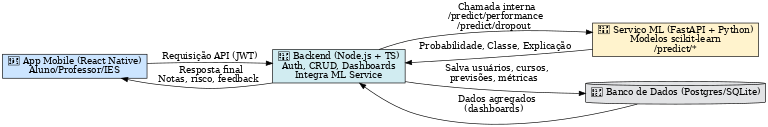

# 📘 Projeto – Sistema de Previsão de Desempenho e Risco de Evasão  

## 🎯 Objetivo  
Este projeto apoia **alunos, professores e instituições de ensino (IES)** através de uma plataforma que utiliza **Machine Learning clássico** para prever:  
1. **Desempenho acadêmico** (nota esperada/probabilidade de aprovação).  
2. **Risco de evasão** (baixo, médio ou alto).  

A solução busca **antecipar problemas de aprendizagem** e fornecer **insights interpretáveis** para reduzir a evasão e melhorar o desempenho dos alunos.  

---

## 👥 Público-alvo  
- **Alunos**: recebem previsões personalizadas sobre desempenho e risco de evasão em cada disciplina, com feedback explicativo.  
- **Professores**: acessam dashboards com visão da turma, identificando alunos em risco e priorizando ações.  
- **IES (Admin)**: gerenciam cursos, disciplinas e usuários, além de acompanhar métricas agregadas.  

---

## 🔧 Como funciona  
1. O aluno se cadastra e escolhe a disciplina do semestre.  
2. Ele preenche um formulário com dados de hábitos, frequência, sono, motivação e engajamento.  
3. Os dados vão para o **Backend (Node.js/TS)**, que autentica, valida e executa os modelos Python diretamente.  
4. O **Backend** executa scripts Python (via `child_process`) que rodam os modelos treinados em **scikit-learn** e retornam probabilidades, classes e fatores explicativos.  
5. O **Backend Node.js** salva os resultados no banco e devolve a resposta final para o app.  
6. Professores e IES acessam dashboards com dados agregados.

**Nota**: Os modelos ML estão integrados no backend em `backend/src/ml/`. Não é necessário rodar um serviço Python separado.  

---

## 🧠 Machine Learning  

### Datasets utilizados  
- **StudentPerformanceFactors.csv** → prever desempenho (nota).  
- **xAPI-Edu-Data.csv** → prever engajamento e risco de evasão.  

### Modelos aplicados  
- **Regressão Linear** → previsão de notas.  
- **Regressão Logística** → aprovação/reprovação e evasão.  
- **Árvore de Decisão / Random Forest** → comparação de desempenho (se houver tempo).  

### Métricas de avaliação  
- **Classificação**: F1-Score, ROC-AUC, Matriz de Confusão.  
- **Regressão**: MAE (Mean Absolute Error), R².  
- **Explicabilidade**: coeficientes da regressão e feature importance.  

---

## 🧩 Funcionalidades do MVP  

### Aluno  
- Login seguro (JWT).  
- Formulário de hábitos e engajamento.  
- Resultado previsto de nota, aprovação e risco de evasão.  
- Feedback explicativo.  

### Professor  
- Cadastro/listagem de alunos.  
- Dashboard da turma com indicadores de desempenho e evasão.  
- Filtros por disciplina.  

### IES (Admin)  
- Cadastro de cursos, disciplinas e usuários.  
- Dashboard agregado por curso/disciplina/professor.  

---

## 🏗️ Arquitetura  

- **App Mobile**: React Native (aluno/professor/IES).  
- **Backend Node.js (TS)**: autenticação, CRUD, dashboards, execução direta de modelos ML.  
- **Modelos ML (Python)**: scripts Python integrados no backend que carregam modelos `.pkl` e executam previsões.  
- **Banco de Dados (Postgres/SQLite)**: armazena usuários, cursos, disciplinas, matrículas e previsões.  
- **Segurança**: JWT, bcrypt, HTTPS, controle de acesso por perfil.  

📊 **Fluxograma da arquitetura:**  
  

---

## 📂 Estrutura do Projeto  

```
/backend        # Node.js + TS (CRUD, auth, dashboards, modelos ML integrados)
  /src
    /ml         # Scripts Python, modelos .pkl e datasets
    /service    # Serviços incluindo mlService.ts
/frontend       # App em React Native
/docs           # Documentação e decisões
```

---

## 🛠️ Stack Tecnológica  

- **Backend**: Node.js (Express), TypeScript, Prisma.  
- **ML**: Python (executado via child_process), scikit-learn, pandas, joblib, shap.  
- **Banco**: SQLite (dev) / PostgreSQL (prod).  
- **Mobile**: React Native.  
- **Infraestrutura**: Docker, docker-compose, Railway/Render/Heroku.  
- **Segurança**: JWT, bcrypt, HTTPS.  

---

## 🗓️ Plano de Sprints  

- **Sprint 1**: Modelos ML prontos, API base, banco configurado, protótipos definidos.  
- **Sprint 2**: Endpoints completos, CI/CD, dashboards iniciais, segurança básica.  
- **Sprint 3**: App Mobile integrado, dashboards agregados, demo ponta a ponta.  

---

## 📈 Métricas de sucesso  

- Modelos com **F1 ≥ 0.70** e **ROC-AUC ≥ 0.75**.  
- API com tempo de resposta **p95 < 300ms**.  
- Funcionalidade ponta a ponta validada (aluno → API → dashboards).  

---

## 🤝 Contribuição  

- Branches: `feat/<COD-XXX>-descricao-curta`  
- Commits: prefixados com o código da task (ex.: `AM-005: treino modelo logístico`).  
- PRs: revisão obrigatória por outro membro.  
- CI/CD: deploy automático em ambiente de teste.  

---

## 📜 Autoria  

Projeto desenvolvido pela equipe **InnoCode Solutions** – 5º semestre de DSM.  

**Equipe**: Mauro Santos (PO), Jonatas (SM), Samuel, Igor, Vitor.  
